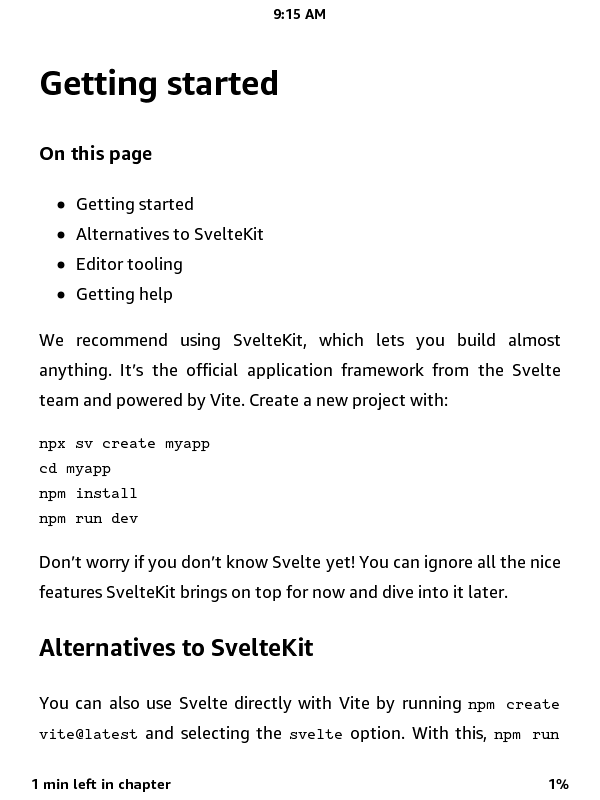
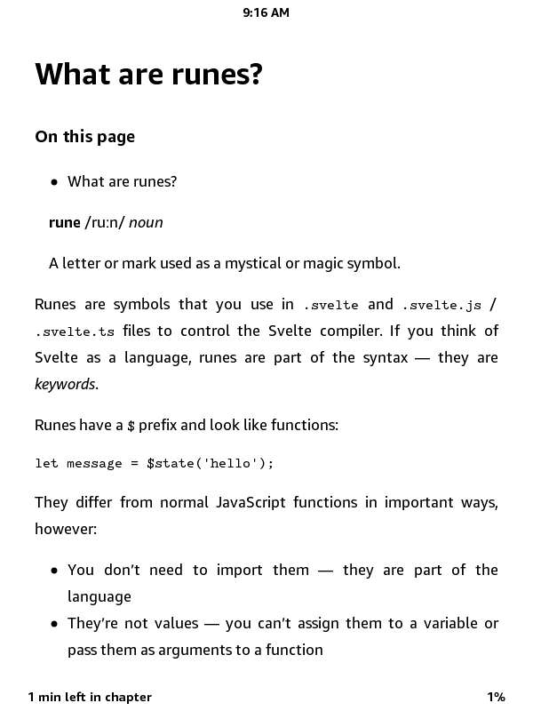
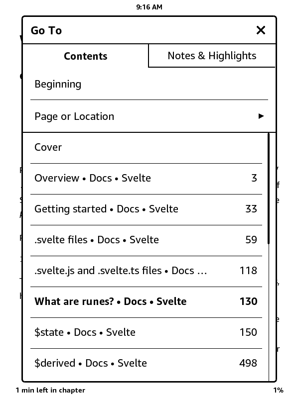
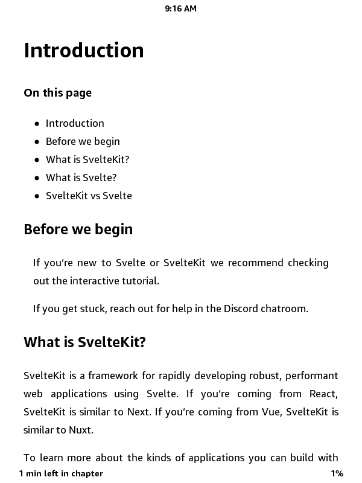
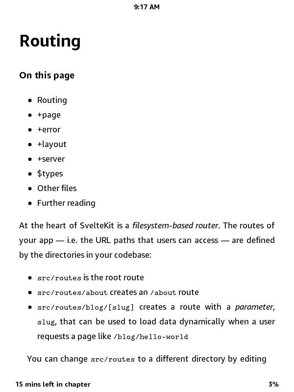
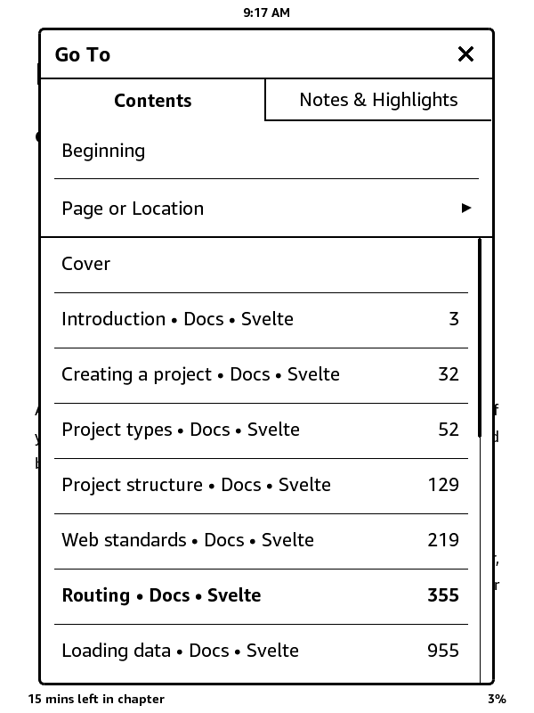
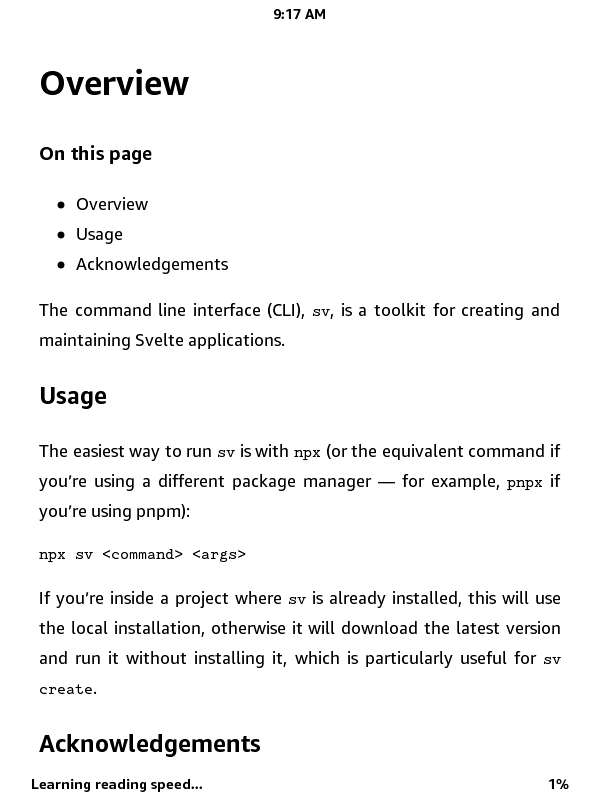
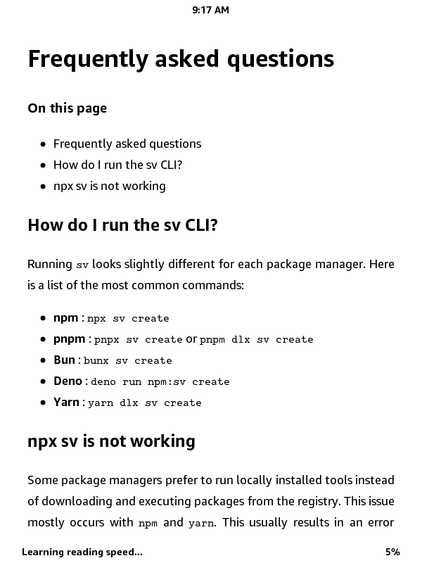
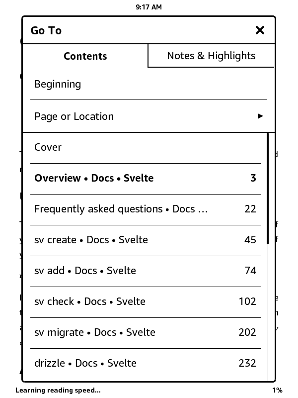

# 📚 svelte-docs-epub

This project builds clean, Kindle/ereader-friendly **EPUB** and **AZW3** versions of the official documentation for:

- [Svelte](https://svelte.dev/docs/svelte)
- [SvelteKit](https://svelte.dev/docs/kit)
- [svelte-cli](https://svelte.dev/docs/cli)

All styling is stripped for full compatibility with Kindle and other e-ink devices. The content is fully navigable with TOC, proper chapters, and readable code blocks using default system fonts.

---

## 🖼️ Screenshots

| Book       | Image 1                                       | Image 2                                       | TOC                                               |
|------------|-----------------------------------------------|-----------------------------------------------|---------------------------------------------------|
| Svelte     |  |  |  |
| SvelteKit  |    |    |    |
| Svelte CLI |  |  |  |

---

## 📥 Download Latest eBooks (2025-05-07)

| Format | Svelte | SvelteKit | svelte-cli |
|--------|--------|-----------|-------------|
| **EPUB** | [📘 svelte-docs.epub](ebooks/2025-05-07/svelte-docs.epub) | [📘 sveltekit-docs.epub](ebooks/2025-05-07/sveltekit-docs.epub) | [📘 svelte-cli-docs.epub](ebooks/2025-05-07/svelte-cli-docs.epub) |
| **AZW3** | [📗 svelte-docs.azw3](ebooks/2025-05-07/svelte-docs.azw3) | [📗 sveltekit-docs.azw3](ebooks/2025-05-07/sveltekit-docs.azw3) | [📗 svelte-cli-docs.azw3](ebooks/2025-05-07/svelte-cli-docs.azw3) |

> ✅ Optimized for Kindle and Kobo  
> ✅ Fully offline  
> ✅ No external dependencies or styling  
> ✅ Lightweight and versioned

---

## 🛠️ How It Works

- Scrapes official docs using **Python** + **requests** + **BeautifulSoup**
- Uses **Jinja2** templates to generate valid EPUB structure
- Packages all assets manually for EPUB
- Uses **Calibre CLI** (`ebook-convert`) to generate AZW3 from EPUB
- Stores eBooks under `ebooks/YYYY-MM-DD/` for version tracking

---

## 📦 Project Structure

```text
ebooks/
  └── YYYY-MM-DD/
      └── [EPUB and AZW3 files]
pypub/
  ├── epub.py
  └── templates/
      ├── chapter.xhtml.j2
      ├── content.opf.j2
      └── toc.ncx.j2
static/
  └── container.xml
svdocs.py  ← main build script
svelteshots/ ← output screenshots
````

---

## 🚧 Roadmap

* [ ] Inline Table of Contents at the start of the book
* [ ] Cross-reference linking between sections
* [ ] Optional minimal syntax highlighting (Kindle-safe)
* [ ] GitHub Action to auto-build from latest docs weekly

---

## 📝 License

MIT License © 2025 [iaseth](https://github.com/iaseth)
